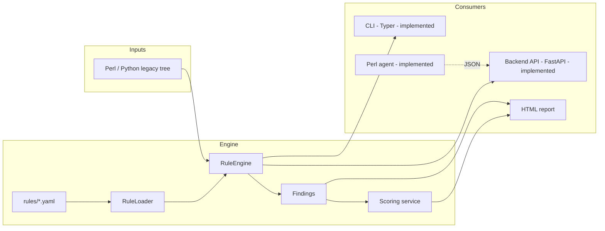

# AegisLegacy

**Python/Perl Runtime Security & Modernization Platform** — a platform for
scanning, scoring, and planning the modernization of legacy Perl and
Python applications.

> Status: in active, incremental development. See [ROADMAP.md](ROADMAP.md)
> for exactly what is implemented vs. planned — this README describes the
> target shape of the project, not a finished product.

## What it does (target scope)

AegisLegacy scans a legacy codebase (`.pl`, `.pm`, `.cgi`, `.py`, `.sh`,
config files) and reports on:

- command injection risk (`system()`, backticks, `subprocess(shell=True)`)
- unsafe dynamic code execution (`eval`, `exec`, insecure deserialization)
- hardcoded secrets and cloud credentials
- legacy/hard-to-maintain patterns (two-argument `open`, oversized
  functions, missing input validation)

...then turns the findings into a **security score** (0–100, with an
Excellent/Good/Needs improvement/Risky/Critical classification), an HTML
report, and modernization recommendations (keep / refactor / isolate /
migrate / replace).

## Architecture



Layering (implemented so far in `backend/app`):

- `domain/` — pure data models (`Severity`, `Language`, `Finding`). No I/O.
- `rules/` — YAML schema validation (`schema.py`), loading (`loader.py`),
  and pattern matching against files (`engine.py`).
- `services/` — orchestration on top of domain objects (`scoring.py`,
  `scan_service.py`).
- `repositories/` — SQLModel table models and a `ScanRepository` (SQLite).
- `api/` — FastAPI schemas, dependencies (auth, DB session), routes.
- `core/` — centralized `Settings` (env-driven, `AEGIS_` prefix).
- `security/` — isolated API-key verification (constant-time compare).
- `observability/` — structlog JSON logging setup.
- `workers/`, `reports/` — not implemented yet; see `ROADMAP.md`.

## What's actually implemented right now

**The rules engine** — the dependency root for everything else:

- `backend/app/domain/{severity,language,findings}.py`
- `backend/app/rules/{schema,loader,engine}.py`
- `backend/app/services/scoring.py`
- 8 demo detection rules in `rules/{perl,python,secrets}/`
- 50 passing tests (`backend/tests/`), `ruff check` clean, `mypy --strict` clean

**The CLI**, built directly on top of it:

- `aegis scan <path>` — scans a file or directory, prints a Rich findings
  table and a score panel, optionally writes JSON (`--output`), exits
  non-zero on critical findings.
- `aegis rules list` — lists every loaded detection rule.
- `aegis doctor` — checks the local environment (Python version, rules
  directory present and loading correctly).
- 21 passing tests (`cli/tests/`), `ruff check` clean, `mypy --strict` clean.
- `report generate`, `score <scan_id>` and `diff` are intentionally **not**
  registered yet — see "Known scope gaps" in `ROADMAP.md`.

**The backend API**, FastAPI + SQLModel on SQLite:

- `POST /api/v1/scans` (API-key protected) — runs a scan synchronously and
  persists it.
- `GET /api/v1/scans` (paginated), `GET /api/v1/scans/{id}`,
  `GET /api/v1/scans/{id}/findings`, `GET /api/v1/scans/{id}/score`.
- `GET /api/v1/rules` — the loaded detection rules.
- `GET /health`.
- Centralized `Settings` (env-driven), structlog JSON logging,
  constant-time API-key check isolated in `app/security/api_key.py`.
- 83 passing tests (`backend/tests/`, including full API tests with an
  in-memory SQLite override), `ruff check` clean, `mypy --strict` clean.
- No HTML report endpoint yet (needs `app/reports`), no worker queue
  (scans run in-request) — see `ROADMAP.md`.

### Try it — the fast way (no manual setup)

`aegis.ps1` (Windows/PowerShell) and `aegis.sh` (bash/git-bash/Linux/macOS)
are self-installing wrappers: the first call creates the virtualenv and
installs everything, later calls just run the CLI. Nothing to activate.

```powershell
.\aegis.ps1 scan demo-legacy-app
```

```bash
./aegis.sh scan demo-legacy-app
```

### Try it — the manual way

```bash
# from the repo root, one shared virtualenv for backend + cli
python -m venv .venv
.venv/Scripts/activate          # or: source .venv/bin/activate
pip install -e "backend[dev,api]" -e "cli[dev]"

pytest backend/tests cli/tests   # 104 passed
ruff check backend cli           # clean
mypy backend/app                 # clean, strict mode
mypy --config-file cli/pyproject.toml cli/aegislegacy  # clean, strict mode

aegis rules list
aegis scan demo-legacy-app

# run the API
uvicorn app.main:app --app-dir backend --reload
curl http://127.0.0.1:8000/health
curl -X POST http://127.0.0.1:8000/api/v1/scans \
  -H "Content-Type: application/json" -H "X-API-Key: changeme-local-dev-key" \
  -d '{"target_path": "demo-legacy-app"}'

# the Perl agent needs no install at all (core Perl modules only)
perl agent-perl/bin/aegis-agent.pl --path demo-legacy-app
```

```python
from pathlib import Path
from app.rules.loader import load_rules_from_directory
from app.rules.engine import RuleEngine
from app.services.scoring import compute_score

rules = load_rules_from_directory(Path("rules"))
engine = RuleEngine(rules)
findings = engine.scan_tree(Path("/path/to/legacy/project"))

result = compute_score(findings)
print(result.score, result.classification)
```

## Stack

- **Python**: 3.12+, pydantic v2, Typer, Rich, FastAPI, SQLModel (SQLite),
  structlog, pytest, ruff, mypy (strict) — implemented (rules engine, CLI,
  backend API).
- **Perl 5**, core modules only (`File::Find`, `Digest::SHA`, `JSON::PP`,
  `HTTP::Tiny`, `Getopt::Long`) — implemented (`agent-perl/`).
- **Jinja2** (HTML reports), Postgres/Redis/Celery — planned, see `ROADMAP.md`.

## Why this project

It's built module-by-module, in dependency order, with each module held to
the same bar before moving to the next: typed, tested, linted, and
documented — rather than a wide surface of half-working scaffolding. The
rules engine shipped first because the CLI, the API, and the Perl agent's
JSON contract all depend on its `Finding` shape; the CLI shipped second
because it validates that shape end-to-end with zero extra infrastructure;
the backend API shipped third, adding persistence (SQLite via SQLModel)
and turning a one-off scan into a queryable, auditable history.

## Security note

This is a defensive tool. Any intentionally vulnerable code lives only
under `demo-legacy-app/` as inert, local-only fixtures for detection demos
— never real secrets, never offensive tooling.

## License

BSD 3-Clause, see [LICENSE](LICENSE).
